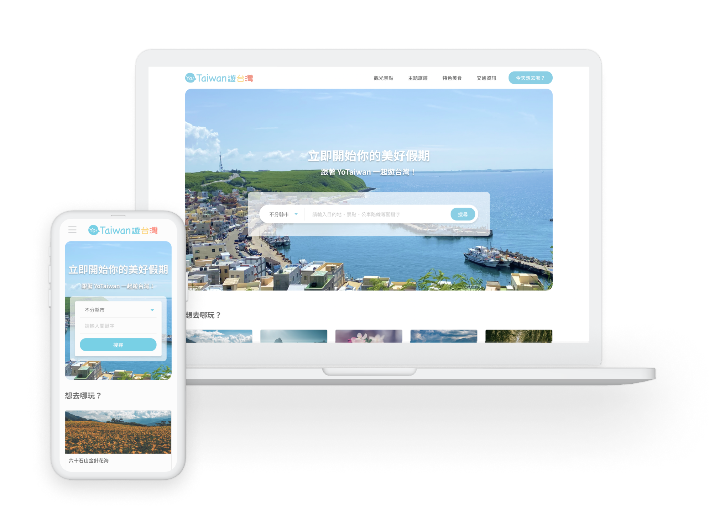

# Yo-Taiwan | [Demo](https://mshmwr.github.io/yo-taiwan/)

Yo-Taiwan is a Taiwan travel website, providing information on food and attractions in Taiwan and Taiwan Tourist Shuttle Routes. YoTaiwan also provides a classification for current hot themes of sopts, so that lovers of outdoor activities such as diving and camping can find the target attractions more quickly.

YoTaiwan為台灣觀光旅遊網站，提供全台各縣市美食與景點資訊及台灣好行公車路線查詢。另外，網站針對時下流行旅遊主題，提供「主題旅遊」景點分類，讓潛水、露營等戶外活動愛好者可以更快速找到目標景點。在Yo-Taiwan，我們使用 React 串接 MOTC 以及 中央氣象局 API，實作台灣旅遊景點以及對應天氣功能。

Front-end development: [Yi-Chen Lee](http://linkedin.com/in/yichenlee-career) / [Elsa Lan](https://www.linkedin.com/in/elsa-lan/) / [Shan Chi Hung](https://www.linkedin.com/in/beckyhung37/)

Design: [Shan Chi Hung](https://www.linkedin.com/in/beckyhung37/)

Event: [The F2E](https://2021.thef2e.com/) group project.

## Skills Structure

### Front-end development
Script: JavaScript ES6

Style: CSS / SCSS / CSS module

API: Axios

React: JSX / React Router / React Hooks / React Context / React Leaflet

### Development Tool
create-react-app / babel / react-app-rewired / NPM

ESLint/Prettier / Git/GitHub

### Data Source
[MOTC API](https://ptx.transportdata.tw/MOTC/)

[Central Weather Bureau Opendata API](https://opendata.cwb.gov.tw/dist/opendata-swagger.html#/%E9%A0%90%E5%A0%B1/get_v1_rest_datastore_F_C0032_001)

## Component Planning

## Features

### 1.Tourist Attractions and Food in Taiwan
We use the Ministry of Transport's "Public Transport Data Exchange Platform (PTX)" to connect to the tourist information API, and provide users with inquiries according to the categories of tourist attractions, themed itineraries and special food.

全台特色景點與美食: 使用交通部「公共運輸整合資訊流通服務平臺(PTX)」串接觀光資訊api，並依照觀光景點、主題旅遊和特色美食的類別供使用者查詢

### 2.Keyword Search
We use regex to filter the area code of attractions addresses.

關鍵字搜尋: 使用regex過濾部分地址的鄉鎮市區前會寫的區碼。

### 3.Themed Itineraries:
We provide a classification for current hot themes of sopts, so that lovers of outdoor activities such as diving and camping can find the target attractions more quickly.

熱門主題旅遊分類: 針對時下流行旅遊主題，提供「主題旅遊」景點分類，讓潛水、露營等戶外活動愛好者可以更快速找到目標景點。

### 4.Central Weather Bureau Nowcast:
We connect with the Central Weather Bureau nowcast API, display the real-time weather of attractions and food.

中央氣象局即時天氣: 串接中央氣象局即時天氣api，根據縣市查照對應天氣及顯示天氣圖案。

### 5.Taiwan Tourist Shuttle Routes
We use the Ministry of Transport's "Public Transport Data Exchange Platform (PTX)" to connect to the Taiwan Tourist Shuttle Routes API. You can choose different routes according to the cities in Taiwan.

台灣好行公車路線地圖: 使用交通部「公共運輸整合資訊流通服務平臺(PTX)」串接台灣好行交通資訊api，可依地區選擇不同交通路線，並以地圖呈現空間分佈。

### 6.Responsive Web Design
Responsive design for mobile, tablet and computer screen sizes.

響應式設計: 採用響應式設計，包含手機、平板及電腦螢幕大小。

